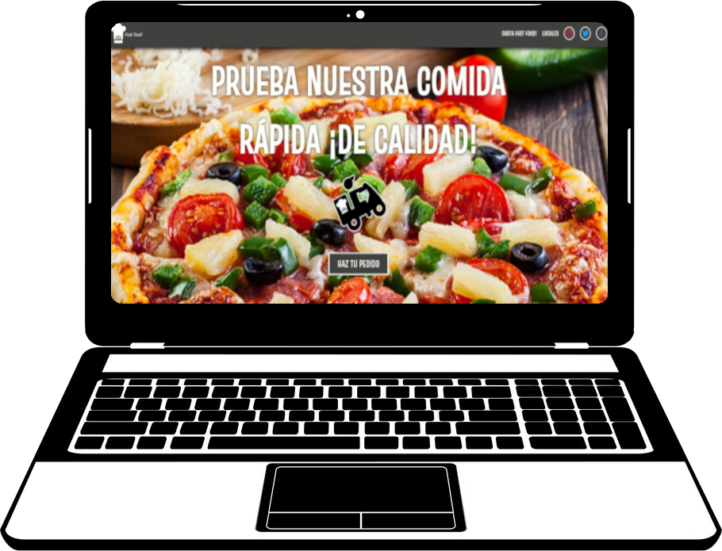
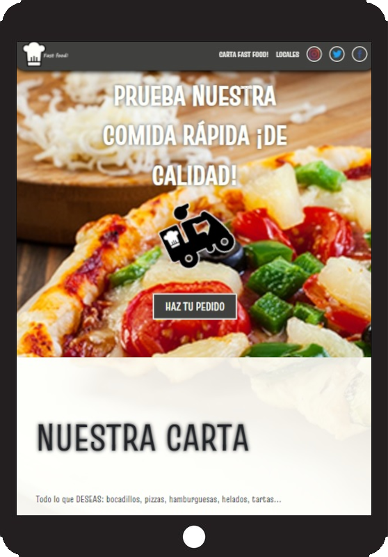
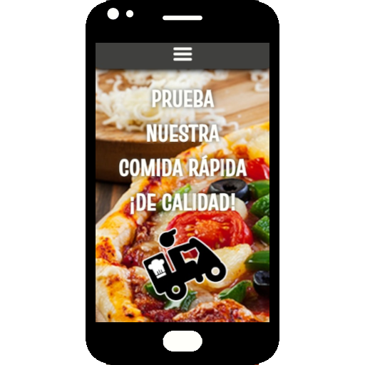

# Pagina de Restaurante

## Realización de proyecto en academia Geeks Hubs Academy. Nos solicitan realizar la página de un restaurante (página de inicio, página de contacto y carta online).

## Utilizo para la realización del proyecto las tecnologías HTML, CSS y Javascript.

## La página consta de las siguientes características:

* Diseño totalmente responsive para cualquier dispositivo.
***

***

***

***
* Añadido de enlaces hacia diferentes partes de la página y hacia otras páginas del mismo sitio web.
***
* Efecto `:hover` sobre varios elementos del sitio web
***
* Animación en menu superior al hacer scroll en la página (versión móvil y tablet).
***
* Aparición de botón para dirigirse a la parte superior de la página
***
* Cambio en el menú superior al cambiar la resolución de la pantalla a menos de 500px.
***
* Creación de filtro de búsqueda en la sección "Locales" de la página principal del sitio web.
***
* Creación de una página por cada local existente. En dicha página se añade el horario y el teléfono del local, así como una foto del mismo y su ubicación.
***
* Carta interactiva: podemos pinchar en el icono + de cada producto para añadirlo a la sección "Pedido". Se añadirá el producto y el precio, el cual se irá sumando al total del pedido. Existen productos los cuales no podremos añadir directamente, si no que necesitaremos desplegar un menú. Al añadir el primer producto aparecerá un botón, el cual al ser pulsado nos llevará directamente a ver los artículos añadidos. Cualquiera de estos artículos podrán ser eliminados de la sección "Pedido" pulsando el botón -.
***
## Si lo deseas, puedes escanear el siguiente código qr, para poder acceder a la carta directamente desde el móvil. ¡Es la manera óptima de visualizarlo!

***
